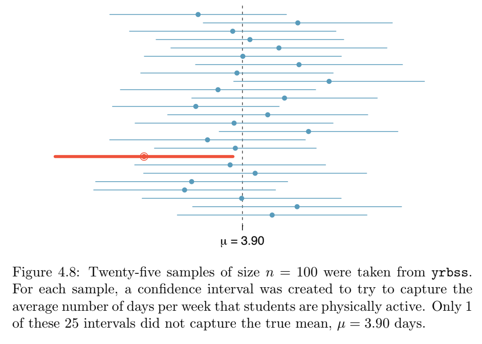

```{r setup, include=FALSE}
library(MASS)
library(knitr)
library(htmlTable)
knitr::opts_chunk$set(echo = FALSE)
mytable <- function(x, ...) { knitr::asis_output(paste0("<center>", htmlTable(x, ..., rnames=F, css.cell = "padding-left: .5em; padding-right: .2em;"), "</center>")) }

library(moments) # skewness
library(corrplot)

library(dplyr, warn.conflicts = F)
```

## Estatística: descritiva vs. inferencial

- Descritiva:
    - Descreve, sumariza e tira conclusões sobre os dados coletados
    - Não tenta generalizar para outros dados
- Inferencial
    - A partir dos dados coletados, procura tirar conclusões inclusive sobre dados que não foram coletados!
    - A partir de uma **amostra**, tenta tirar conclusões sobre um conjunto maior, a **população**

# Amostragem

## Amostragem (sampling)

- **População** = conjunto de dados sobre os quais queremos tirar conclusões
- **Amostra** = subconjunto da população que analisaremos
- **Amostragem** = processo de seleção de uma amostra da população

Analisar a população inteira pode ser inviável. Podemos analisar apenas uma amostra e generalizar as conclusões... isso se a amostra for **representativa** da população.

## Exemplo

- Um professor se afasta no meio do semestre e é substituído por outro professor.
- O professor substituto deseja ter noção das notas da turma de 40 alunos na prova já realizada.
- Ele pergunta as notas dos 5 alunos na fileira da frente e conclui que a turma foi muito bem na prova.
- Perguntas:
    - Qual é a amostra?
    - Qual é a população?
    - A escolha da amostra foi adequada ou é **enviesada** (*biased*)?

## Evidência anedótica

- Evidência baseada em poucos casos
- Tamanho da amostra = 1 ou 2 ou poucos

## Tipos de amostragem

Os tipos de amostragem mais comuns são:

- amostragem por conveniência
- amostragem aleatória simples
- amostragem estratificada

## Amostragem por conveniência

<!-- - Ex.: Para tirar conclusões sobre todos os estudantes da UFBA, considerar a amostra dos alunos da disciplina Engenharia de Software Experimental no semestre corrente. -->

- Seleciona os indivíduos que estão mais próximos, mais disponíveis
    - Exemplo real: pesquisa de intenção de voto presidencial por telefone na década de 1940 nos EUA
    - Por que essa amostra é enviesada?
- Geralmente não resulta em uma amostra representativa da população -- viés de seleção
- Consequentemente não é possível generalizar os resultados da amostra para a população
- Pode ser usada em estudos piloto

## Viés de auto-seleção

Exemplo:

- Para entender o cenário de desenvolvimento de software no Brasil, um pesquisador envia um questionário para todos os desenvolvedores de software do Brasil
- Apenas 2% dos contactados respondem o questionário (taxa de resposta)
- O que se pode concluir?
- Viés de não-resposta.
- Dica: garanta uma taxa de resposta alta para mitigar o viés (ex.: ofereça um prêmio para os participantes)

## Viés de auto-seleção

Um dia desses coloquei um questionário na minha página. Olha só o resultado:

**Você costuma responder a questionários online?**

```{r}
pie(table(c(rep("sim", 98), rep("nao", 2))))
```

O que posso concluir?

## Amostragem aleatória simples

- A seleção é feita de forma aleatória (sorteio)
- Todos os indivíduos possuem a mesma probabilidade de serem selecionados
- A seleção de um indivíduo não aumenta nem diminui as chances de outro indivíduo

## Amostragem aleatória simples

- Melhor do que por conveniência
    - Note que nenhuma amostragem **garante** que a amostra será representativa
- Em uma amostragem aleatória simples dos estudantes da UFBA, posso acabar selecionando, ao acaso, apenas os estudantes desta turma (mas isso é muito improvável!)
- A representatividade tende a ser maior quando:
    - A amostra é grande; ou
    - A variância da variável estudada na população é pequena ("se é todo mundo parecido, tanto faz quem eu escolho")

## Amostragem estratificada (stratified sampling)

- Divide a população em subgrupos (homens/mulheres, crianças/adolescentes/adultos, iniciante/experiente), denominados estratos
- Pega uma amostra aleatória simples de cada estrato, de forma que o tamanho de cada amostra seja proporcional ao tamanho do estrato na população
- É mais efetiva quando cada estrato possui baixa variância (as pessoas de um determinado grupo possuem características similares)

# Probabilidade

## Probabilidade

- É a medida da chance de um evento ocorrer
    - P(A): probabilidade de o evento A ocorrer
- Varia entre 0 (impossível) e 1 (certo, inevitável)

## Visões sobre a probabilidade

- Três visões sobre probabilidade:
  - resultados simétricos
  - frequência relativa
  - probabilidade subjetiva

## Visões sobre a probabilidade

- Resultados simétricos
    - Ao lançar um dado, qual a probabilidade de o dado cair com o número 2 pra cima?
    - Um dado possui 6 faces. Ao lançar o dado, a probabilidade de cair com determinada face para cima é a mesma para todas as faces. Logo, a probabilidade de cair o número 2 para cima é 1/6 (0.1666...)

## Visões sobre a probabilidade

- Frequência relativa
    - Se eu jogar um dado várias vezes, à medida que o número de vezes tende a infinito, o número de vezes que a face 2 cai pra cima é ⅙ do total de lançamentos.
    - Qual a probabilidade de chover amanhã?
    - Se dos últimos 100.000 dias, em 5% choveu em Salvador, a probabilidade de chover amanhã é de 5%
    - Mas dos dias do mês corrente dos últimos 5 anos, em 10% houve chuva em Salvador; então a probabilidade de chover amanhã é de 10%...

## Visões sobre a probabilidade

- Subjetiva
    - Qual a probabilidade de haver uma 3ª guerra mundial este ano?
    - Especialistas no assunto podem atribuir probabilidades com base em avaliações subjetivas sobre a atual conjuntura política.

## Probabilidade de um resultado

- Probabilidade de um resultado X, P(X):
    - P(X) = número de vezes que o resultado foi X / número de resultados possíveis
    - (assumindo que todos os resultados têm a mesma probabilidade)
- Ex.: probabilidade de a moeda cair com "coroa" para cima (½)
- Ex.: probabilidade de sortear uma carta do naipe de copas (13/52)

## Probabilidade de dois resultados independentes

- Dois resultados/eventos são independentes se a ocorrência de um não afeta a probabilidade de o outro ocorrer
- P(A e B) = P(A) * P(B)
  - Ex.: probabilidade de obter dois 6 em dois lançamentos de dado
- P(A ou B) = P(A) + P(B) - P(A e B)
  - Ex.: probabilidade de obter um 5 ou um 6 em um lançamento de dado

## Falácia do apostador

- Falácia é um erro de lógica
- Uma moeda é lançada 5 vezes e o resultado é coroa 5 vezes.
- Qual é a probabilidade de o resultado ser cara no próximo lançamento?

## Probabilidade condicional

- Qual a probabilidade de sortear um Ás no baralho? P(carta é Ás) = 4/52
- Qual a probabilidade de sortear dois ases no baralho?
- P(1ª carta é Ás e 2ª carta é Ás) = 4/52 * 4/52???
- Os eventos são independentes?

## Probabilidade condicional

- Qual a probabilidade de sortear um Ás no baralho? P(carta é Ás) = 4/52
- Qual a probabilidade de sortear dois ases no baralho?
- A = a primeira carta é Ás
- B = a segunda carta é Ás
- A e B não são eventos independentes! Se A acontece, as chances de B acontecerem diminuem para 3/51!

## Probabilidade condicional

- A = a primeira carta é Ás
- B = a segunda carta é Ás
- P(B|A) = 3/51  (a probabilidade de a segunda ser Ás dado que a primeira foi Ás)
- Isso é chamado de probabilidade condicional.

## Probabilidade condicional

[](https://xkcd.com/795/)

## Probabilidade de dois resultados dependentes

P(A e B) = P(A) * P(B|A)

## Tópicos opcionais em probabilidade

- (ver [slides](https://docs.google.com/presentation/d/1H4_XZRhjrZnxABet_IXejwPu72e3XlgNoOgZtFrp6oM/edit?usp=sharing))
- Problema de Monty Hall (opcional, dinâmica durante a chamada)
- Teorema de Bayes (opcional)
  - Ex.: filtragem de spam
  - Ex.: HIV (O andar do bêbado)

# Estimativa

## Estimativa: definição

- É um valor aproximado de um parâmetro da população obtido a partir de uma amostra
- Pode ser também o processo de encontrar esse valor (do verbo *estimar*)

## Parâmetro e estatística

- **Parâmetro** é uma característica da população
    - Ex.: média de altura dos cidadãos brasileiros
- **Estatística** é uma característica de uma amostra
    - Ex.: média de altura de uma amostra dos cidadãos brasileiros
- Estimar: determinar um parâmetro a partir de uma estatística

## Estimativa: tipos

- Uma estimativa pode ser
    - pontual
    - intervalar

## Estimativa pontual

- Consiste de um único valor
- Ex.: se média da amostra = 1,73, então estima-se que a média da população = 1,73
- Problema: a estimativa pontual não representa incertezas
- Se pegar outra amostra, a estimativa pontual vai ser a mesma?

## Distribuição amostral

- Se eu pegar várias amostras e plotar um histograma das estimativas pontuais, obtenho a distribuição amostral
- Ver <https://istats.shinyapps.io/sampdist_cont/>

## Distribuição amostral

- Ver <https://speakerdeck.com/jakevdp/statistics-for-hackers?slide=12>

```{r}
resultado <- c()
num_experimentos <- 10000
experimentos_com_22_caras_ou_mais <- 0
for (i in 1:num_experimentos) {
  
  caras <- 0
  for (lancamento in 1:30) {
    deu_cara <- sample(c(TRUE, FALSE), 1)
    if (deu_cara) { caras <- caras + 1 }
  }
  resultado[i] <- caras
  
  if (caras >= 22) {
    experimentos_com_22_caras_ou_mais <- experimentos_com_22_caras_ou_mais + 1
  }  
}

cat(100 * experimentos_com_22_caras_ou_mais / num_experimentos, '%', sep='')
hist(resultado)
abline(v = 22, col = "red")
```

## Estimativa intervalar

- A estimativa é dada por um **intervalo de confiança**, que é uma faixa de valores e por um **nível de confiança**
    - **Nível de confiança**: probabilidade de um parâmetro estar incluído no intervalo de confiança
- Forma de escrever: estatística ± margem de erro
    - Exemplo: a estimativa da média de altura das mulheres brasileiras é de 1,60 ± 0,07 metros, com 95% de confiança.
    - 1,60 metros é a estatística (média da amostra)
    - 0,07 metros é a margem de erro

## Estimativa intervalar



## Tamanho da amostra, nível de confiança, desvio-padrão

- Quanto maior o nível de confiança desejado, maior o intervalo
No extremo, podemos dizer com 100% de confiança que a altura média da população está no intervalo 0 ± ∞

```{r}

genero <- na.omit(survey$Sex) 
num_mulheres <- sum(genero == "Female")
tam_amostra <- length(genero)

# Estimativa pontual da proporção de mulheres na população
num_mulheres / tam_amostra

# Estimativa intervalar
prop.test(num_mulheres, tam_amostra, conf.level = 0.95)


# Resultado:
#   95 percent confidence interval:
#   0.4367215 0.5632785
```

```{r}
h = survey$Height[!is.na(survey$Height)] # alturas em cm

# Estimativa pontual
mean(h)

sample(h, 20) %>% mean()

# Estimativa intervalar
t.test(h, conf.level = 0.95)

# Resultado da estimativa intervalar:
#   95 percent confidence interval:
#   171.0380 173.7237


```


## Continuação

https://docs.google.com/presentation/d/1H4_XZRhjrZnxABet_IXejwPu72e3XlgNoOgZtFrp6oM/edit#slide=id.g120a867426_0_16


