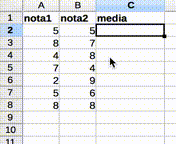

```{r setup, include=FALSE}
# Para instalar os pacotes necessários para executar este código, rode
# o comando a seguir:
#
# install.packages(c("dplyr", "stringr", "knitr", "htmlTable", "corrplot", "moments", "pander"))

set.seed(0)

knitr::opts_chunk$set(echo = FALSE)
library(dplyr)
library(tibble)
library(stringr)
library(knitr)
library(htmlTable)
library(corrplot)
library(moments)

library(pander)
#mytable <- pander
#mytable <- kable
mytable <- function(x, ...) { knitr::asis_output(paste0("<center>", htmlTable(x, ..., rnames=F, css.cell = "padding-left: .5em; padding-right: .2em;"), "</center>")) }
mycolor <- 'paleturquoise'
mycolor2 <- 'rosybrown2'
mycolor3 <- 'palegoldenrod'
mycolors <- c(mycolor, mycolor2, mycolor3)
set.seed(0)
```

## Em que você baseia suas decisões no dia-a-dia?

- intuição?
- dados?

##


## Como interpretar os dados?

- Exemplo: número de vendas diárias de um app
- Em determinado dia, foram 50 vendas
- Depois de uma campanha de marketing, foram 70 vendas
- Houve um aumento das vendas?

## Depende!

```{r}
rnorm(n=50, mean = 50, sd=2) %>% plot(type='l', ylim=c(40, 80))
```

## Depende!

```{r}
rnorm(n=50, mean = 60, sd=10) %>% plot(type='l', ylim=c(40, 80))
```

## Cientista raiz vs. Nutella

```{r}
df <- tribble(
  ~`Cientista raiz`, ~`Cientista nutella`,
  "Vai ao deserto coletar dados", "Usa dados abertos",
  "Faz análises no Excel", "Usa R",
  "Sabe todas as fórmulas de cor", "Sabe o nome das funções R",
  "Desenha gráficos com régua", "Usa funções pra desenhar na tela",
  "Decora todos os passos da análise", "Escreve a análise em um script automático"
)
pander(df)
```

## R

- <http://r-project.org/>
- Linguagem de programação muito usada para análise de dados
- Open source
- Interpretada
- Tem muitos pacotes para análise de dados

## Exemplo com Excel



## Excel: prós e contras

- *Pró*: Interface intuitiva
- *Pró*: Vasta documentação
- *Contra*: é apenas semiautomático
    - Ao adicionar novos dados, é preciso arrastar a célula da fórmula

<!-- C
#include <stdio.h>

int main() {
	float nota1[] = {5, 8, 4, 7, 2, 5, 8};
	float nota2[] = {5, 7, 8, 4, 9, 6, 8};
	float media[7];
	int i;
	
	for (i = 0; i < 7; i++) {
		media[i] = (nota1[i] + nota2[i]) / 2;
		printf("%.2f ", media[i]);
  }
}
-->

## Mesmo exemplo em Java

```java
class Media {
  public static void main(String[] args) {
  	float nota1[] = {5, 8, 4, 7, 2, 5, 8};
  	float nota2[] = {5, 7, 8, 4, 9, 6, 8};
  	float media[] = new float[nota1.length];
  	int i;
  	
  	for (i = 0; i < media.length; i++) {
  		media[i] = (nota1[i] + nota2[i]) / 2;
  		System.out.println(media[i]);
    }
  }
}
```

## Java: prós e contras

- *Pró*: automático
    - Novos dados? É só recompilar e re-executar
- *Contra*: Precisa compilar
- *Contra*: código verboso (veja o `for`)

## Mesmo exemplo em R

```r
nota1 <- c(5, 8, 4, 7, 2, 5, 8)
nota2 <- c(5, 7, 8, 4, 9, 6, 8)

media <- (nota1 + nota2) / 2

print(media)
```

## R: prós e contras

- *Pró*: linguagem sucinta para operações com conjuntos de dados
- *Pró*: interpretada
- *Pró*: muitas bibliotecas e funções prontas para manipular dados
- *Contra*: mais uma linguagem para aprender
    - Mas você está em um curso da área de computação

## Análise qualitativa vs. quantitativa

- Qualitativa
    - Dados qualitativos (textos, imagens etc.)
    - Ajuda a formular hipóteses
    - Ex.: [Analyze this! 145 questions for data scientists in software engineering](https://www.microsoft.com/en-us/research/publication/analyze-this-145-questions-for-data-scientists-in-software-engineering/)
- Quantitativa
    - Dados quantitativos (números, contagens)
    - Ajuda a verificar hipóteses
    - Ex.: [Predicting Defects for Eclipse](https://www.st.cs.uni-saarland.de/publications/files/zimmermann-promise-2007.pdf)

## Disciplina e avaliação

- Na maior parte do tempo, não usaremos dados de experimentos
    - Usaremos dados históricos produzidos naturalmente como parte do desenvolvimento de software (código-fonte, bugs, commits etc.)
- Nas partes práticas, usaremos a linguagem R
- **Avaliação**
    - relatório curto com análise quantitativa do conjunto de dados [GHTorrent](http://ghtorrent.org/relational.html)
    - em duplas ou trios

## Referências

- [R for Data Science](http://r4ds.had.co.nz/)
- [R Cheat Sheets](https://www.rstudio.com/resources/cheatsheets/)
- [OpenIntro Statistics](https://www.openintro.org/stat/)
- [Online Statistics Education: An Interactive Multimedia Course of Study](http://onlinestatbook.com/)

Outros:

- <http://www.biostathandbook.com/>
- <http://www.statmethods.net/>
- <http://stattrek.com/>
- <http://www.statsref.com/HTML/index.html>
- <http://www.itl.nist.gov/div898/handbook/index.htm>
- <http://www.statstutor.ac.uk/>