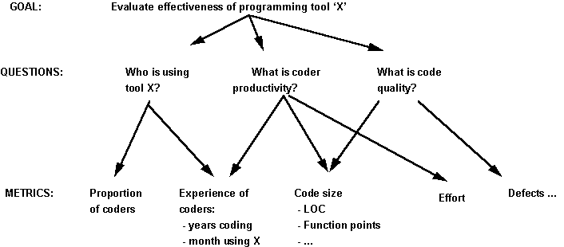
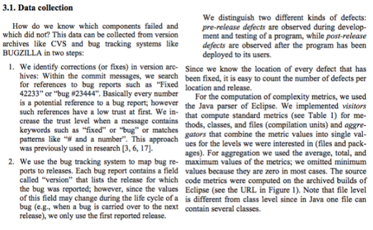

```{r setup, include=FALSE}
knitr::opts_chunk$set(echo = FALSE)
library(MASS, warn.conflicts = F)
library(dplyr, warn.conflicts = F)
```


## Dados

- Podem ser representados de diferentes formas
- Representação hierárquica. Ex.: árvore genealógica
- Representação tabular. Ex.: pessoas, com peso, altura e idade

## Dados tabulares

- Cada linha é uma **observação** ou **caso**
- Cada coluna é uma **variável**
- Na estatística, estamos interessados nas características das variáveis e nas relações entre as variáveis

## Dados tabulares

```{r}
survey %>%
  select(genero = Sex, idade = Age, altura = Height, exercicio = Exer, pulsacao = Pulse) %>%
  mutate(
    genero = case_when(
      .$genero == 'Male' ~ 'M',
      .$genero == 'Female' ~ 'F'),
    exercicio = case_when(
      .$exercicio == 'Some' ~ 'Algum',
      .$exercicio == 'None' ~ 'Nenhum',
      .$exercicio == 'Freq' ~ 'Frequente')) %>%
  head(7) %>%
  knitr::kable()
```

## NA

- No R, `NA` indica um valor faltante, isto é, um valor que não existe ou não foi coletado

## Variáveis

Uma variável pode ser:

- categórica
    - nominal (igual ou diferente)
    - ordinal (maior ou menor)
- numérica
    - discreta (ex.: quantidade)
    - contínua (ex.: tempo)

## Análise de dados

É o processo de inspecionar, limpar, transformar e modelar dados com o objetivo de descobrir informação útil, sugerindo conclusões e dando suporte à tomada de decisão

## Etapas da análise de dados

- *requisitos*
- coleta
- limpeza e transformação
- *análise exploratória*
- modelagem / análise
- comunicação dos resultados

## Requisitos

- De quais dados preciso para atingir meus objetivos?
- De que forma os dados devem estar representados?
- Abordagem GQM (Goal-Question-Metric):
  
  

## Coleta: abordagens

- **Manuais**
    - Formulários
    - Entrevistas
    - Observação
- **Automáticas**
    - Instrumentação de software (software que registra o que o usuário faz)
    - Download de arquivos (ex.: dump de banco de dados, exportar como XML…)
    - Acesso a APIs remotas (ex.: GitHub API, Travis CI API)
    - Crawling (pegar informações de páginas na web)

## Coleta: fontes de dados

- Código-fonte (ex.: Java, C, Python)
- Sistemas de controle de versão (ex.: Git, Subversion)
- Gerenciadores de tarefas/bugs (ex.: Bugzilla, Redmine, Jira, GitHub)
- Sistemas de revisão de código (ex.: Gerrit, Review Board)
- Sistemas de integração contínua (ex.: Jenkins, Travis CI, GitLab CI)
- Sites de perguntas e respostas (ex.: StackOverflow)
- Listas de discussão, fóruns e bate-papo (ex.: Mailman, IRC, )
- Sites e wikis
- e outros...

## Coleta

- Coleta de dados históricos pode ser difícil
- Na disciplina vamos usar conjuntos de dados já coletados
- Alguns conjuntos de dados prontos para analisar:
    - <https://rodrigorgs.github.io/msr-datasets>
    - Conferência: Mining Software Repositories (todo ano tem MSR Challenge) 

## Coleta: exemplo

- Exemplo: seção 3.1 do artigo [Predicting defects for Eclipse](https://www.st.cs.uni-saarland.de/softevo/bug-data/eclipse/promise2007-dataset-20a.pdf)



## Limpeza

O que fazer com dados...

- incompletos?
    - Ex.: não sei de qual versão é este bug.
- inconsistentes?
    - Ex.: Quem consertou o bug? Commit diz Fulano, bug diz Sicrano.
- que possuem múltiplas representações?
    - Ex.: nome de usuário em SCM, issues e e-mails. “Será que os usuários que mais enviam e-mails introduzem mais bugs no código-fonte?”
- extremos? (outliers)
    - Ex.: Fulano consertou 2 mil bugs em uma hora

## Transformação

- Cálculos simples
    - Ex.: Calcular densidade de bugs a partir de bugs e LOC.
- Operações básicas de bancos de dados
    - Ordenação, filtragem, junção...
- Reshaping
    - Reorganizar os dados. Ver [data wrangling cheat sheet](https://www.rstudio.com/wp-content/uploads/2015/02/data-wrangling-cheatsheet.pdf)
- Agregação de dados
    - Contagem, soma, média...
- Recuperação de informação
    - Extrair dados quantitativos a partir de texto
    - expressões regulares, tf-idf, latent semantic analysis, word cloud, ngrams

## Modelagem

- Tirar conclusões a partir dos dados
- Estabelecer causas e efeitos
- Criar um modelo do fenômeno estudado
- (Será tema de outras aulas)

## Comunicação de resultados

- Texto
- Tabelas
- Gráficos
- O objetivo é informar, não enganar!
  
## Comunicação de resultados: visualização

- O humano não é bom em detectar padrões em conjuntos de muitas informações
- A não ser que essa informação seja apresentada de forma visual
- Visualização significa criar imagens para comunicar informações

## Comunicação de resultados: visualização

- [7 Basic Rules for Making Charts and Graphs](https://flowingdata.com/2010/07/22/7-basic-rules-for-making-charts-and-graphs/)
- [Real Chart Rules to Follow](https://flowingdata.com/2015/08/11/real-chart-rules-to-follow/)
- [Five Ways to Lie with Charts](http://nautil.us/issue/19/illusions/five-ways-to-lie-with-charts)
- [Misleading graph (Wikipedia)](https://en.wikipedia.org/wiki/Misleading_graph)
- [How to Lie With Data Visualization](http://gizmodo.com/how-to-lie-with-data-visualization-1563576606)
